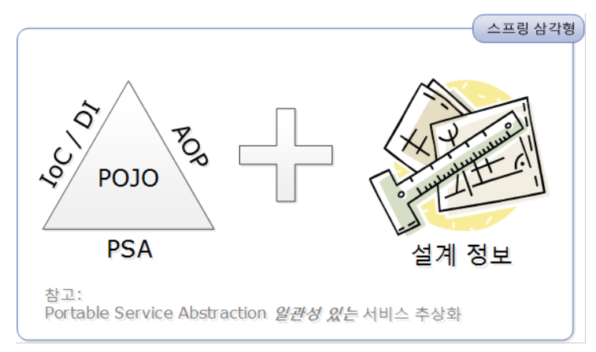

# ch7-1



스프링을 이해하는 데는 **POJO(Plain Old Java Object)**를 기반으로 **IoC/DI, AOP, PSA**라고 하는 스프링의 3대 프로그래밍 모델에 대한 이해가 필수다.

### 1. **PoJo(Plain old java object) 란?**

객체 지향적인 원리에 충실하면서 환경과 기술에 종속되지 않고 (다른 클래스나 인터페이스를 상속/implements 받아 메서드가 추가된 클래스가 아닌 **)** 필요에 따라 재활용될 수 있는 방식으로 설계된 오브젝트를 말한다. 그러한 POJO에 애플리케이션의 핵심로직과 기능을 담아 설계하고 개발하는 방법을 POJO 프로그래밍이라고 할 수 있다. 

과거에는 자바로 웹 어플리케이션을 개발하기 위해서는 Servlet 클래스를 상속받아서 사용했다. 스프링은 Servlet 클래스를 사용하지 않고 POJO만으로 웹 어플리케이션을 개발할 수 있다는 것이 특징이다.

### 2. IoC (Inversion of Control) / DI (Dependency Injection) - 제어의 역전 / 의존성 주입

**의존 관계?**

*의존대상 B가 변하면, 그것이 A에 영향을 미친다.*

**IoC란**

Spring Container는 Spring Bean들의 생명주기를 관리한다. 빈의 생성과 관계, 사용, 생명 주기를 관리하고  컨테이너를 통해 등록된 빈들은 시스템에 전반적으로 사용 가능하다. 즉 오브젝트 전반에 걸친 모든 제어권을 애플리케이션이 갖는게 아니라 외부인 프레임워크의 컨테이너에게 넘기는 개념을 말한다.

**DI (의존성 주입)란**

객체를 직접 생성하는 게 아니라 특정 객체에 필요한 객체를 외부에서 결정해서 필요로 하는 시점에 연결시켜 주는 방식이다.  외부에서 객체를 생성하고 넘겨주는 것을 스프링에서는 DI 컨테이너가 행하며 모든 애플리케이션 컴포넌트를 생성, 관리하고 해당 컴포넌트를 필요로 하는 빈에 주입한다.  또한 다른 빈을 주입받으려면 자기 자신이 반드시 컨테이너의 빈이여야 한다

DI(의존성 주입)를 통해서 모듈 간의 결합도가 낮아지고 유연성이 높아진다.

의존성 주입을 사용하지 않은 예

```java

public class  User {

    private Mask mask;
    
    public User(){
    	this.mask = mask;
    }
```

위와 같은 예시는 User와 Mask가 객체간의 관계가 아닌 클래스 간의 관계로 강하게 결합되어 있기 때문에 Mask의 변화가 User 에 영향을 미친다. 즉, 안전성이 떨어지고 유지보수에 있어서 좋지 않다.

**의존성 주입의 방법은 3가지가 있는데,**

1. **Constructor based Injection →** 생성자가 1개일 경우 @Autowired를 생략해도 된다.

```java
@RestController
public class  UserController {

    private final UserService userService;
    
    public UserController(UserService userService){
    	this.userService = userService;
    }
```

1. **Setter based Injection** 

```java
@RestController
public class  UserController {

    private UserService userService;
    
		@Autowired
    public void setUserService (UserService userService){
    	this.userService = userService;
    }
```

1. **Field Injection**

```java
@RestController
public class UserController {

    @Autowired
    private UserService userService;
    
}
```

**세 방식의 차이이자 생성자 방식을 지향해야 하는 이유는?**

1. **불변성 확보**

수정자 주입 방법을 사용한다면 set 메서드를 public으로 열어 두어야 하며 즉, 싱글톤 패턴 기반의 빈이 변경될 위험이 있다.

생상자 주입 방법은 생성자 호출시점에 딱 한번만 호출 되는 것을 보장하므로 **final을 선언**하여 불변하게 설계할 수 있다. 또한 필수적으로 사용해야하는 의존성 없이는 인스턴스를 만들지 못하도록 강제할 수 있기

1. **테스트 코드 작성**

점점 테스트 코드 작성의 중요성은 높아져 간다. 또한 DI 프레임 워크의 핵심 아이디어는 관리되는 클래스가 DI 컨테이너에 의존하지 않고 필요한 의존성이 주입됬다면 독립적으로 인스턴스화 할 수 있는 단순한 POJO 여야 한다. 하지만 **필드 주입 방법**은 반드시 DI 프레임워크 위에서 동작해야 하므로 단위 테스트 시 클래스를 인스턴스화 할 수 없다.

하지만 **생성자 주입 방법**은 컴파일 시점에 객체를 주입받아 테스트 코드를 작성할 수 있으며, 주입하는 객체가 누락된 경우 컴파일 시점에 오류를 발견할 수 있다. 

**4. 순환 참조 방지**

다음과 같은 경우

```java
public class A {
    @Autowired
    B b;

    public void callB(){
        b.call();
    }

}
```

```java
public class B {
    @Autowired
    A a;

    public void callA(){
        a.call();
    }

}
```

위의 callB, callA 메소드는 서로를 계속 호출할 것이고, 메모리에 함수의 CallStack이 계속 쌓여 StackOverflow 에러가 발생하고 서버는 곧 죽게 될 것이다. 이를 **순환 참조 문제**라 한다.

하지만, **생성자 주입**을 이용한다면,

컨테이너가 빈을 생성하는 시점에 (컴파일 시점) 객체 생성 도중 사이클 관계가 생기기 때문에 스프링에서 오류를 발생해 알려준다.

수정자, 필드 주입 방식과 달리 비즈니스 로직 시작 전 컴파일 단계에서 순환참조를 잡을 수 있는 것은 큰 이점이다. 

### ToDo :  SpringBean 과 Singleton의 관계