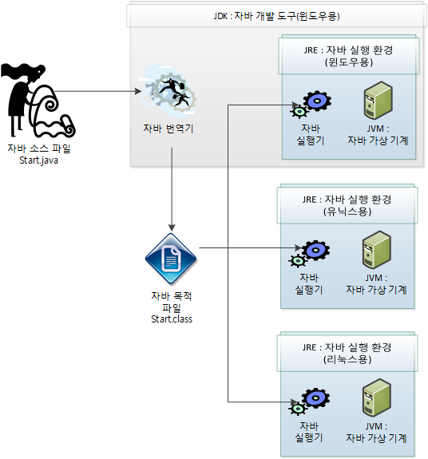
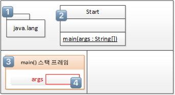
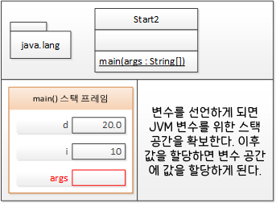
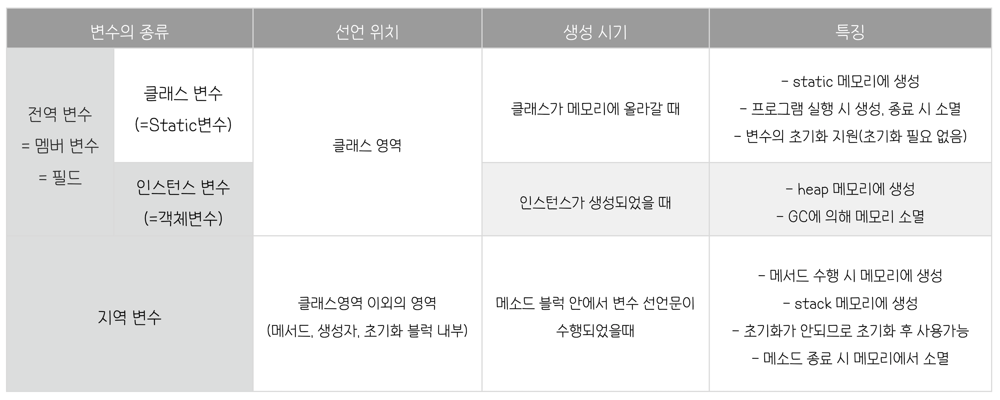

# 02 자바와 절차적/구조적 프로그래밍


## 자바 프로그램의 개발과 구동

> 자바는 자바 개발도구인 JDK를 이용해 개발된 프로그램은 JRE에 의해 JVM 상에서 구동된다.


#### JDK, JRE, JVM의 관계



- JDK는 자바 소스 컴파일러,  JRE는 자바 프로그램 실행기 포함
- 사용 중인 플랫폼에 설치된 JVM용으로 프로그램을 작성하고 배포하면 각 플랫폼에 맞는 JVM이 중재자로서 각 플랫폼에서 설치된 JVM용으로 프로그램을 구동하는 데 아무 문제가 없게끔 만들어줌 ➔ **`Write Once Run Anywhere`** 

```
JDK : Java Development Kit / 자바 개발 도구
JRE : Java Runtime Environment / 자바 실행 환경
JVM : Java Virtual Machine / 자바 가상 기계
```


#### 객체 지향 프로그램의 메모리 사용 방식


## main() 메서드 

> main() 메서드가 실행될 때 메모리, 특히 T 메모리에는 어떤 일이 일어날까?

​	

###### T 메모리 구조


---




#### main() 메서드가 실행되기 전 JVM에서 수행하는 전처리 작업들 

- java.lang 패키지를 T 메모리 **static 영역에 배치** 1️⃣
- import 된 패키지를 T 메모리 **static 영역에 배치** 2️⃣
- 프로그램 상의 모든 클래스를 T 메모리 **static 영역에 배치** 2️⃣


#### 그 다음으로, 

- main() 메서드가 실행되기 위해 **스택 프레임(stack frame)이 stack 영역에 할당** 3️⃣
   - 여는 중괄호를 만날 때마다 스택 프레임이 하나씩 생김
- 메서드의 인자 `args  ` 를 저장할 변수 공간 즉, **메서드 인자의 변수 공간 할당** 4️⃣


###### ➔ JRE는 뒤에서 JVM이라는 가상 머신을 부팅하고 JVM은 메모리 구조를 만들어 각종 패키지 로딩, 메인 메서드 스택 프레임 배치, 변수 공간 배치 등의 일을 처리한다.

###### ➔ 메서드의 끝을 나타내는 닫는 중괄호를 만나면 생성한 **"스택 프레임"**이 사라진다.  프로그램의 시작점인 **메인 메서드가 끝나면 JRE는 JVM을 종료하고 JRE 자체도 운영체제 상의 메모리에서 사라지게 된다.**


## 변수와 메모리 




#### 메서드 간 변수 참조 금지

- 메서드는 자신만의 고유한 공간이므로 침범하면 안 된다.
- 서로의 변수를 참조하려면 위치(주소)를 알아야 하는데 그러기 위해서 `포인터` 가 필요하다. **(포인터 없는 것이 자바의 장점)**
- 포인터가 없기때문에 메서드 간 변수 참조가 불가능하다.

➔ 자바는 메서드를 호출하면 인자를 저장한 값을 복사해서 전달하는 **"Call by value"** 방식을 사용하고 있다.

➔ 객체를 넘기는 것도 객체의 주소값을 복사해서 넘기는 것이다. (자바는 사실상 "Call by reference"가 없다.)


---




#### 지역 변수

> **지역 변수**

- 메서드 블럭 안에 선언된 변수로 메서드의 블록이 끝나는 순간 생명이 다한다.
- 메서드 내에 선언되어 메서드 내에서만 사용 가능하다.
- for문 또는 while문의 블록 내에 선언된 지역 변수가 선언된 { } 블럭 안에서만 사용가능하며, { } 블럭을 벗어나게 되면 소멸되어 사용할 수 없게 된다.


#### 전역 변수

> **인스턴스 변수**

- 클래스 영역에 선언되며, 클래스의 인스턴스를 생성할 때 만들어진다. 
- 인스턴스마다 독립적인 저장공간을 가지므로 서로 다른 값을 가질 수 있다.
- 인스턴스마다 고유한 상태를 유지해야하는 경우 인스턴스 변수로 선언하여 사용한다.

> **클래스 변수** 

- `static` 키워드 붙은 변수 
- 클래스 변수는 인스턴스가 공통된 저장 공간(변수)을 공유한다.
- 한 클래스의 모든 인스턴스들이 공통적인 값을 유지해야하는 경우 클래스 변수로 선언하여 사용한다.


## 멀티 스레드 & 멀티 프로세스의 이해

#### 멀티스레드 & 멀티 프로세스


- 멀티 스레드는 스택 영역을 분할해서 사용
- 멀티 스레드는 스택 영역만 분할했기때문에 하나의 스레드에서 다른 스레드의 static 영역과 heap 영역은 공유해서 사용할 수 있다.
   - 멀티 프로세스 대비 메모리를 적게 사용하는 구조


- 멀리 프로세스는 다수의 T 메모리를 생성하여 사용
- 멀티 프로세스는 하나의 프로세스가 다른 프로세스의 T 메모리 영역을 절대 침범할 수 없는 구조
   - 안전한 구조이지만 메모리 사용량은 크다.


➔ ***요청당 스레드(Servlet)가 요청당 프로세스(CGI)보다 효율적인 이유***

➔ ***멀티쓰레드에서 전역변수 사용은 문제를 발생시키고 해결을 위한 lock은 멀티스레드의 장점을 버린 것과 같다.***

