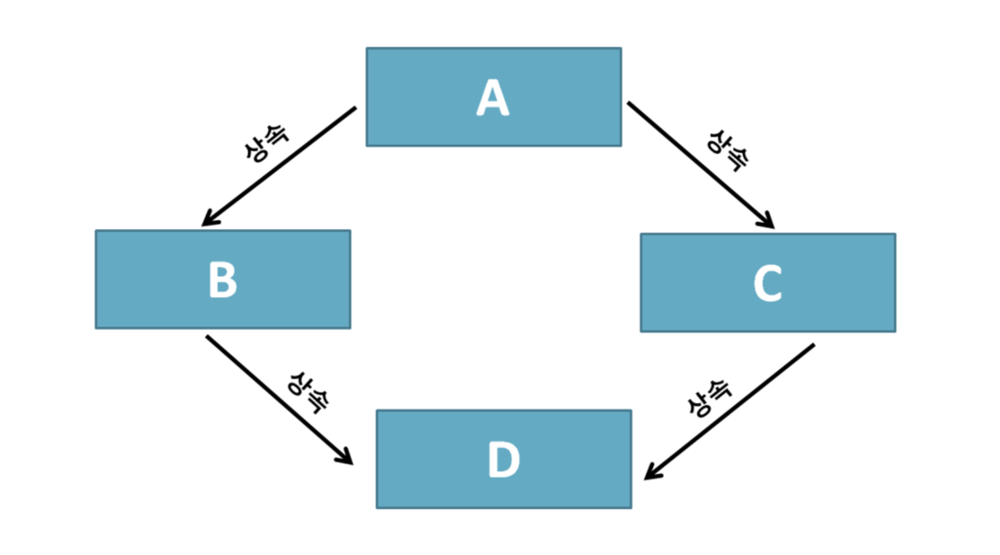

## 객체 지향

왜 기계 종속적인 개발을 해야하는가? 현실 세계처럼 프로그래밍을 할 수 없을까? -> 객체 지향의 개념 탄생

### 객체 지향의 4대 특성

- 캡슐화(Encapsulation) : 정보 은닉(Information hiding)
- 상속(~~Inheritance~~) : 재사용
- 추상화(Abstraction) : 모델링
- 다형성(Polymorphism) : 사용 편의


## 클래스 vs 객체

클래스는 분류에 대한 개념. 실체가 아니다. / 객체는 실체다.

객체 : 유일무이한 사물이다.

클래스 : 분류, 집합. 같은 속성과 기능을 가진 객체를 총칭하는 개념


## 추상화 : 모델링

```
추상 : 여러 가지 사물이나 개념에서 공통되는 특성이나 속성 따위를 추출하여 파악하는 작용
```

객체를 특성(속성 + 기능)에 따라 분류해 보니 객체를 통칭할 수 있는 집합적 개념-클래스가 나오게 된다.

- 명사로 표현되는 특성을 **속성**이라고 한다. 속성은 값을 가질 수 있다.
- 동사로 표현되는 특성을 **기능/행위**라고 한다. 수행 절차 또는 로직이라고 하는 것을 갖게 된다. 객체 지향에서는 **메서드**라고 한다.

애플리케이션 경계(Context) - 내가 만들고자 하는 애플리케이션은 어디에서 사용될 것인가?

애플리케이션 경계에 따라 클래스의 설계가 달라진다.

```
// 일반적인 뜻
추상화란 구체적인 것을 분해해서 관심 영역에 대한 특성만을 가지고 재조합하는 것

// IT 용어
추상화란 구체적인 것을 분해해서 관심 영역(애플리케이션 경계, Application Boundary)에 있는 특성만 가지고 재조합하는 것 = 모델링
```

- 모델은 실제 사물을 정확히 복제하는 게 아니라 **목적에 맞게 관심 있는 특성만을 추출**해서 표현하는 것이다.
- 모델은 추상화를 통해 실제 사물을 단순하게 묘사하는 것이다.
- 모델링(추상화)은 객체 지향에서 클래스를 설계할 때, 데이터베이스의 테이블을 설계할 때 필요한 기법이다.

### 정리

클래스 설계에서 추상화가 사용된다.

클래스 설계를 위해서는 애플리케이션 경계부터 정해야한다.

추상화 = 모델링 = 자바의 class 키워드

클래스와 객체 관계 표현

```
클래스 객체_참조_변수 = new 클래스();
```


### 추상화와 T 메모리

```java
public class Mouse {
  public String name;
  public int age;
  public int countOfTail;
  
  public void sing() {
    System.out.println(name + "찍찍!!!");
  }
}

public class MouseDriver {
  public static void main(String[] args) {
    // Mouse 객체에 대한 참조 변수 mickey를 만든다.
    // Mouse 클래스의 인스턴스를 하나 만들어 힙에 배치한다.
    // Mouse 객체에 대한 주소를 참조 변수 mickey에 할당한다.
    Mouse mickey = new Mouse();
    
    mickey.name = "미키";
    mickey.age = 85;
    mickey.countOfTail = 1;
    
    mickey.sing(); // 코드 실행 영역에서 실행된다.
    
    mickey = null; // 더 이상 힙 영역에 존재하는 Mouse 객체를 참조하지 않는다. -> 가비지 컬렉터가 정리하여 힙 영역의 메모리 공간에서 빠진다.
    
    Mouse jerry = new Mouse();
    
    jerry.name = "제리";
    jerry.age = 73;
    jerry.countOfTail = 1;
    
    jerry.sing();
  }
}
```


## 클래스 멤버 vs 객체 멤버 = static 멤버 vs 인스턴스 멤버

같은 유형(클래스)의 모든 객체가 같은 값을 가지고 있다면 그 값을 클래스에 저장하는 건 어떨까?

-> static 키워드를 속성 앞에 붙인다.

```java
public class Mouse {
  public String name;
  public int age;
  public static int countOfTail = 1; // T 메모리의 스태틱 영역에 단 하나의 저장 공간을 갖게 된다.
  
  public void sing() {
    System.out.println(name + "찍찍!!!");
  }
}
```

- static 키워드가 붙은 속성을 **클래스 멤버 속성**이라고 한다.
- static이 안 붙은 속성은 **객체 멤버 속성**이라고 한다.
- 속성뿐만 아니라 메서드도 static 키워드를 붙였느냐 안 붙였느냐에 따라 **클래스 멤버 메서드**, **객체 멤버 메서드**로 분류한다.

클래스 멤버 = static 멤버 = 정적 멤버

객체 멤버 = 인스턴스 멤버

Q) 정적 메서드는 언제 사용하는 것이 좋을까?

- 정적 메서드는 객체들의 존재 여부에 관계없이 쓸 수 있는 메서드다.
- 실무에서는 클래스의 인스턴스를 만들지 않고 사용하게 되는 유틸리티성 메서드를 주로 정적 메서드로 구성한다.
- ex) Math 클래스에 있는 정적 메서드

정적 속성인 경우 T 메모리의 스태틱 영역에 클래스가 배치될 때 클래스 내부에 메모리 공간이 확보된다.

객체 속성은 힙 영역에 객체가 생성되면 바로 그 때 각 객체 안에 멤버 속성을 위한 메모리 공간이 할당된다.

- 클래스 속성과 객체 속성은 별도의 초기화를 해주지 않아도 정수형은 0, 부동소수점형은 0.0, 논리형은 false, 객체는 null로 초기화된다.
- 지역 변수는 별도로 초기화해야 한다.
- 지역 변수는 한 지역에서만 쓰는 변수 /  멤버 변수는 공유 변수의 성격을 가지고 있기 때문에 별도로 초기화를 해주지 않아도 기본값으로 초기화된다.

> 클래스 변수 초기화 시점 : 클래스가 처음 로딩될 때(클래스가 메모리에 올라갈 때)
>
> 멤버 변수 초기화 시점 : 객체가 생성될 때

## 상속 : 재사용 + 확장

객체 지향의 상속은 재사용과 확장으로 이해하는 것이 맞다. 분류도로 이해해야 한다.

객체 지향에서의 상속은 상위 클래스의 특성을 하위 클래스에서 상속(특성 상속)하고 거기에 더해 필요한 특성을 추가, 즉 확장해서 사용할 수 있다는 의미다.

~~부모 클래스 - 자식 클래스~~ -> 상위 클래스 - 하위 클래스 또는 슈퍼 클래스 - 서브 클래스, 상위 분류 - 하위 분류

상위 클래스 쪽으로 갈수록 추상화, 일반화 / 하위 클래스 쪽으로 갈수록 구체화, 특수화

상속 관계에서 반드시 만족해야 할 문장 ==> **하위 클래스는 상위 클래스다.** (LSP - 리스코프 치환 원칙을 나타냄)

상속은 **is-a** 관계 => 더 명확하게 표현 **is a kind of**

- 하위 클래스 is a kind of 상위 클래스
- ex) 펭귄 is a kind of 조류 -> 펭귄은 조류의 한 분류다.

- 객체 지향의 상속은 상위 클래스의 특성을 재사용하는 것이다.
- 객체 지향의 상속은 상위 클래스의 특성을 확장하는 것이다.
- 객체 지향의 상속은 is a kind of 관계를 만족해야 한다.

왜 자바는 다중 상속을 지원하지 않는가? -> 다중 상속의 다이아몬드 문제 



-> 인터페이스를 도입해 다중 상속의 득은 취하고 실은 과감히 버렸다.

- 득 : 여러 클래스로부터 상속받을 수 있기 때문에 복합적인 기능을 가진 클래스를 쉽게 작성할 수 있다.
- 실 : 클래스 간의 관계가 매우 복잡해진다. 서로 다른 클래스로부터 상속받은 멤버 간의 이름이 같은 경우 구별할 수 없다.

'**is able to**'

- 구현 클래스 is able to 인터페이스
- 구현 클래스는 인터페이스 할 수 있다.

**Quiz**

- 상위 클래스는 하위 클래스에게 물려줄 특성이 많을수록 좋을까? 적을수록 좋을까?
- 인터페이스는 구현을 강제할 메서드가 많을수록 좋을까? 적을수록 좋을까?

=> 상위 클래스는 물려줄 특성이 풍성할수록 좋고, 인터페이스는 구현을 강제할 메서드의 개수가 적을수록 좋다는 결론에 도달할 수 있다.

### 상속과 T 메모리

```java
public class Animal {
  public String name;
  
  public void showName() {
    System.out.println("안녕 나는 %s야. 반가워", name);
  }
}

public class Penguin extends Animal {
  public String habitat;
  
  public void showHabitat() {
    System.out.println("%s는 %s에 살아", name, habitat);
  }
}

public class Driver {
  public static void main(String[] args) {
    Penguin pororo = new Penguin(); // 하위 클래스의 인스턴스가 생성될 때 상위 클래스의 인스턴스도 함께 생성된다. (힙 영역) Object 클래스의 인스턴스도 함께 생성된다.
    
    proro.name = "뽀로로";
    proro.habitat = "남극";
    
    pororo.showName();
    pororo.showHabitat();
    
    Animal pingu = new Penguin(); // -> 자신이 동물이라는 것만 인식
    
    pingu.name = "핑구";
    // pingu.habitat = "EBS"; -> 사용X
    
    pingu.showName();
    // pingu.showHabitat(); -> 사용X
    
    // Penguin happyfeet = new Animal(); 하위 클래스가 부모 클래스를 참조할 수 없다?
  }
}
```


## 다형성 : 사용편의성

객체 지향에서 다형성 : 오버라이딩(overriding)과 오버로딩(overloading)

- 오버라이딩 : 같은 메서드 이름, 같은 인자 목록으로 상위 클래스의 메서드를 재정의
- 오버로딩 : 같은 메서드 이름, 다른 인자 목록으로 다수의 메서드를 중복 정의

상위 클래스 타입의 객체 참조 변수를 사용하더라도 하위 클래스에서 오버라이딩(재정의)한 메서드가 호출된다.

`오버로딩`은 함수명 하나를 가지고 인자 목록만 달리하면 되어 사용하기 편리하다. 제네릭을 이용하면 하나의 함수만 구현해도 다수의 함수를 구현한 효과를 낼 수 있다. -> 사용편의성

`오버라이딩`의 경우에 하위 클래스가 재정의한 메서드를 알아서 호출해 줌으로써 형변환이나 instanceof 연산자를 써서 하위 클래스가 무엇인지 신경 쓰지 않아도 된다. -> 깔끔한 코드 유지


## 캡슐화 : 정보 은닉

- private
- [default]
- protected
- public

protected가 자신과 상속 관계에 있는 서브 클래스만 접근 가능한 걸로 착각 -> 같은 패키지라면 접근 가능하다.

정적 멤버인 경우 `클래스명.정적멤버` 형식으로 접근해야 한다. -> 일관된 형식으로 접근하기 위함이다, 메모리의 물리적 접근에 따른 이유도 있다.

- 클래스명.정적멤버 : 스태틱 영역의 정적 멤버
- 객체참조변수명.정적멤버 : 메소드 스택 프레임 -> 힙 영역 인스턴스 -> 스태틱 영역의 정적 멤버


## 참조 변수의 복사

- Call By Value : 저장하고 있는 값을 `그 값 자체`로 해석
- Call By Reference : 저장하고 있는 값을 `주소`로 해석

기본 자료형 변수를 복사할 때, 참조 자료형 변수를 복사할 때 일어나는 일은 같다. 가지고 있는 값을 그대로 복사해서 넘겨 준다.