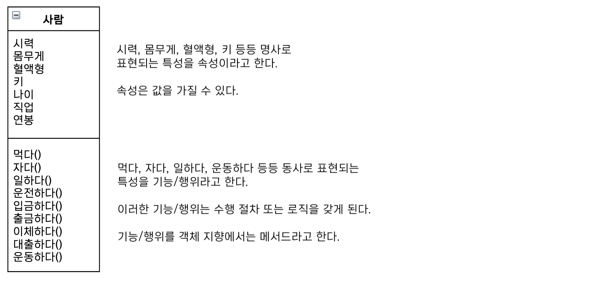
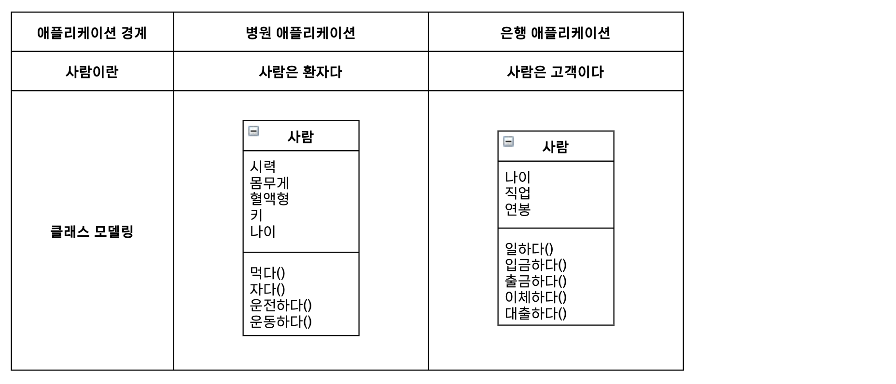
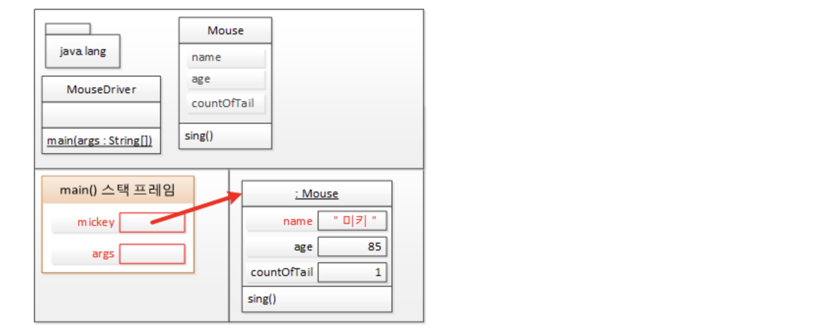
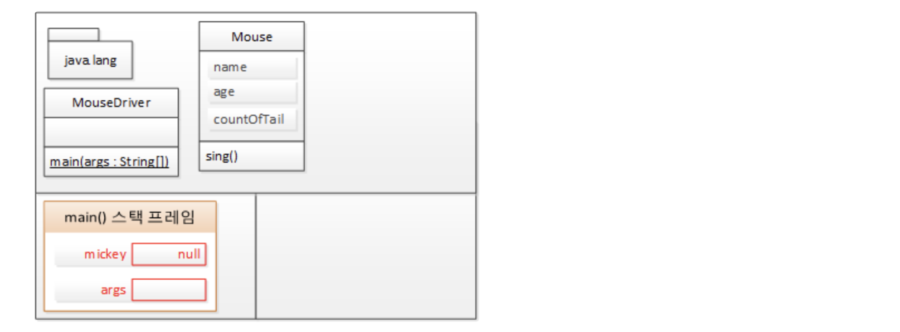

# 03 자바와 객체 지향 

> 객체 지향은 직관적이다. 

- **객체 지향에서는 우리가 주변에서 실제 사물을 인지 및 사고하는 방식대로 객체 단위의 프로그래밍이 가능하다.**
- **객체 지향은 인간의 인지 및 사고 방식까지 프로그래밍에 접목하는 개발자 지향을 실천하고 있는 것이다.**


#### 객체 지향의 4대 특성 - 캡! 상추다

```
• 캡 - 캡슐화 : 정보은닉
• 상 - 상속 : 재사용
• 추 - 추상화 : 모델링
• 다 - 다형성 : 사용 편의 
```


## 추상화 : 모델링

> 객체 지향의 추상화는 곧 모델링이다.


#### "추상화란 구체적인 것을 분해해서 관찰자가 관심 있는 특성만 가지고 재조합하는 것이다. = 모델링"

- **객체** : 세상에 존재하는 유일무이한 사물 
- **클래스** : 같은 특성을 지닌 여러 객체를 속성과 기능을 가진 객체를 총칭하는 개념

**➔ 세상에 존재하는 유일무이한 객체를 특성(속성+기능)에 따라 분류해 보니 객체를 통칭할 수 있는 집합적 개념, 즉 클래스(분류)가 나오게 된다.**

#

###### 사람이라는 클래스를 설계 → 사람 클래스를 만들기 위해 사람 객체들이 가진 공통된 틍성을 찾게 된다.

```
구체적인 것(사물) : 사람

병원의 관심영역 : 시력, 몸무게, 혈액형, 키, 먹다, 자다
은행의 관심영역 : 나이, 직업, 연봉, 일하다, 입금하다, 출금하다
```



➔ 같은 사람을 추상화 하더라도 관심있는 부분에 따라 특성이 달라진다.


**사람 클래스가 사람 객체들의 모든 특성을 나열할 필요가 있을까?** 

- Context(애플리케이션 경계)에 따라 클래스의 설계가 달라질 수 있다.



##### "모델은 목적에 맞게 관심 있는 특성만을 추출해서 표현하는 것, 추상화를 통해 실제 사물을 단순하게 묘사하는 것이다. "


#### 결론

- OOP의 추상화는 모델링이다.
- 클래스 : 객체 = 사람 : 김부희
- 클래스 설계에서 추상화가 사용된다.
- 클래스 설계를 위해서는 애플리케이션 경계부터 정해야 한다.
- 객체 지향에서 추상화의 결과는 클래스다.
- **추상화 = 모델링 = 자바의 class 키워드** 


## 추상화와 T 메모리 

**쥐 클래스 설계** 


쥐 객체를 이용한 클래스 모델링한 논리적 설계 ➔ 물리적 설계

- 논리적 설계 : 개발 환경(언어 등)에 영향을 받지 않는 설계
- 물리적 설계 : 개발 환경에 맞춰진 설계 


```java
public class Mouse {
  public String name;
  public int age;
  public int countOfTail;

  public void sing() {
      System.out.println(name + " 찍찍!!!");
  }
}
```

```java
public class MouseDriver {
  public static void main(String[] args) {
      Mouse mickey = new Mouse();

      mickey.name = "미키";
      mickey.age = 85;
      mickey.countOfTail = 1;

      mickey.sing(); // 미키 찍찍!!

      mickey = null;

      Mouse jerry = new Mouse();

      jerry.name = "제리";
      jerry.age = 73;
      jerry.countOfTail = 1;

      jerry.sing(); // 제리 찍찍!!
  }
}
```

- 모든 클래스들(`Mouse`, `MouseDriver`) 이 T 메모리의 **Static 영역**에 배치
- Mouse 타입의 **객체를 참조할 수 있는 객체 참조 변수** mickey는 **Stack 영역** 중 Main() 메서드 스택 프레임 안에 생성
- Mouse의 name, age, countOfTail 속성은 <u>Mouse 객체에 속한 속성이기 때문에</u> 객체가 생성된 후 속성의 값을 저장하기 위한 **메모리 공간이 Static 영역 아닌 Heap 영역에 할당**



- Heap 영역을 참조하던 변수가 null이 되면, 참조되지 않는 객체를 GC(garbage collections)가 수거해 감




## 클래스 멤버 vs. 객체 멤버 = static 멤버 vs. 인스턴스 멤버 


- 클래스 멤버들은 static 키워드와 함께 사용되고 또 T 메모리의 static 영역에 상주하게 되므로 static (정적) 멤버라고도 한다.

- 객체 멤버들은 객체가 클래스의 인스턴스이므로 인스턴스 멤버라고도 한다.

---


정적 속성인 경우 T 메모리의 Static 영역에 클래스가 배치될 때 클래스 내부에 메모리 공간이 확보되는 것을 보여주지만
객체 속성은 속성명만 있을뿐 실제 메모리 공간은 확보하지 않고 객체 속성은 Heap 영역에 객체가 생성되면 바로 그때 각 객체 안에 멤버 속성을 위한 메모리 공간이 할당된다.


