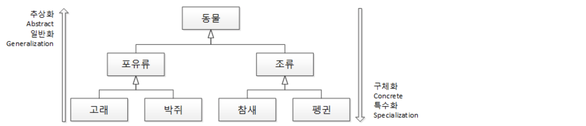
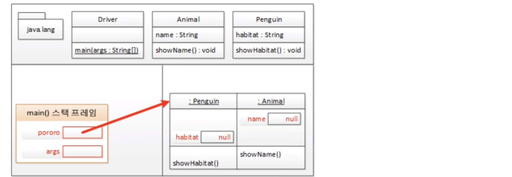
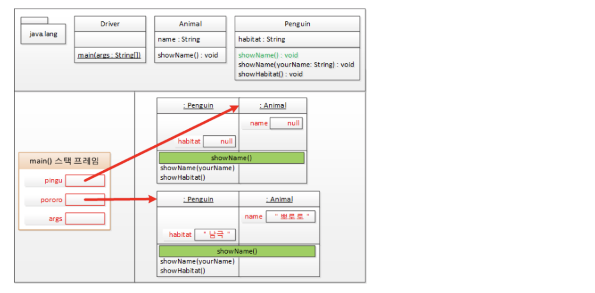
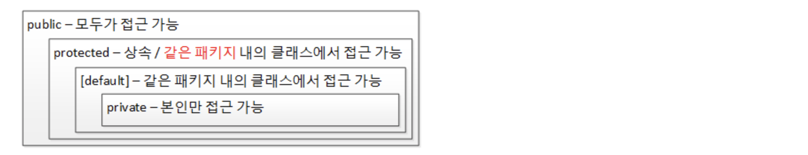

# 03 자바와 객체 지향 


## 상속 : 재사용 + 확장

> 상속이 아닌 **"재사용과 확장"**으로 이해하자





#### 객체 지향에서의 상속이란?

- 상위 클래스의 특성을 하위 클래스에서 상속하고 거기에 더해 필요한 특성을 **추가**, 즉 **확장**해서 사용할 수 있다는 의미

- 일반적으로 생각하는 상속이 아닌 **확장, 세분화, 상위 클래스 - 하위 클래스** 개념
- 상위 클래스 쪽으로 갈수록 **추상화, 일반화** & 하위 클래스 쪽으로 갈수록 **구체화, 특수화** 
- 상속의 개념은 위 그림과 같이 조직도나 계층도가 아닌 **분류도**라는 사실


## 상속은 is a 관계를 만족해야 하나?

> **놉!** 상속은 **is a kind of** 관계를 만족해야 한다.

```
객체 is a 클래스 
is a 관계는 객체(클래스의 인스턴스)와 클래스의 관계로 오해될 소지가 많다.

하위 클래스 is a kind of 상위 클래스
펭귄 is a kind of 조류 → 펭귄은 조류의 한 분류다.
펭귄 is a kind of 동물 → 펭귄은 동물의 한 분류다.
```


#### 정리하면,

- 객체 지향의 상속은 상위 클래스의 특성을 **재사용**하는 것이다.

- 객체 지향의 상속은 상위 클래스의 특성을 **확장**하는 것이다.
- 객체 지향의 상속은 **is a kind of** 관계를 만족해야 한다.


## 다중 상속과 자바 

> 왜 자바는 다중 상속을 지원하지 않는가? 

```
인어는 사람과 물고기를 상속한다고 생각해보자.

사람도 수영할 수 있고, 물고기도 수영할 수 있는데 인어에게 '수영하다'라는 기능을 준다면
인어는 사람처럼 팔과 다리를 저어 수영해야 할까? 아니면 물고기처엄 가슴, 등, 꼬리 지느러미로 헤엄쳐야 할까?

→ 이와 같은 문제 = 다중 상속의 다이아몬드 문제
```

**➔ 자바에서는 인터페이스를 도입하여 다중 상속의 득은 취하고 실은 과감히 버렸다.**


## 상속과 인터페이스

> 상위 클래스는 하위 클래스에게 **특성(속성과 메서드)을 상속**해 주고, 인터페이스는 클래스가 **"무엇을 할 수 있다"** 라는 기능을 구현하도록 강제한다.

#### ✔︎ 상속 = is a kind of 관계

- 상속 : **하위 클래스 is kind of 상위 클래스**

- 해석 : 하위 클래스는 상위 클래스의 한 분류다
- 예제 : 고래는 동물의 한 분류다


###### 인터페이스는 **be able to**, 즉 "무엇을 할 수 있는"를 만족해야 한다.

#### ✔︎ 인터페이스 = be able to 관계

- 인터페이스 : **구현 클래스 is able to 인터페이스**

- 해석 : 구현 클래스는 인터페이스할 수 있다.
- 예제 : 고래는 헤엄칠 수 있다.


**➔ 상위 클래스는 물려줄 특성이 풍성할수록 좋고(LSP), 인터페이스는 구현을 강제할 메서드의 개수가 적을수록 좋다(ISP)**


## 상속과 T 메모리

```java
public class Animal {
	public String name;

	public void showName() {
		System.out.printf("안녕 나는 %s야. 반가워\n", name);
	}
}
```

```java
public class Penguin extends Animal {
	public String habitat;

	public void showHabitat() {
		System.out.printf("%s는 %s에 살아\n", name, habitat);
	}
}
```

```java
public class Driver {
	public static void main(String[] args) {
		Penguin pororo = new Penguin();

		pororo.name = "뽀로로";
		pororo.habitat = "남극";

		pororo.showName(); // 어머 내 이름은 알아서 뭐하게요?
		pororo.showName("sehun"); // sehun 안녕, 나는 뽀로로라고 해
		pororo.showHabitat(); // 뽀로로는 남극에 살아

		Animal pingu = new Penguin();

		pingu.name = "핑구";
    pingu.showName(); // 어머 내 이름은 알아서 뭐하게요?
  }
}
```


#### 상속의 T 메모리

> 하위 클래스의 인스턴스가 생성될 때 상위 클래스의 인스턴스도 함께 생성된다.



```java
Penguin pororo = new Penguin(); // 5번째 줄 
Animal pingu = new Penguin(); // 13번째 줄
```

pororo는 Penguin 타입의 객체이고, pingu는 Animal 타입의 객체로 pingu는 *Heap 영역에서 Animal*을 가리키고 있고, pororo는 *Penguin*을 가리키고 있다. 이 뜻은 "pingu 객체 참조 변수는 사실 펭귄이면서 자신이 펭귄이라는 사실을 모르고 있지만 자신이 동물이라는 것만 인식하고 있다." 라고 말할 수 있다. 그래서 펭귄의 서식지를 알려주는 `showHabitat()` 메서드를 사용할 수 없다. 


## 다형성 : 사용편의성

> **오버라이딩 ? 오버로딩 ?** 

- **오버라이드** : 같은 메서드 이름, 같은 인자 목록으로 상위 클래스의 메서드를 **재정의**
- **오버로딩** : 같은 메서드 이름, 다른 인자 목록으로 다수의 메서드를 **중복 정의**

```java
public class Penguin extends Animal {
	public String habitat;
	
	public void showHabitat() {
		System.out.printf("%s는 %s에 살아\n", name, habitat);
	}

	//오버라이딩 - 재정의: 상위클래스의 메서드와 같은 메서드 이름, 같은 인자 리스트
	public void showName() {
		System.out.println("어머 내 이름은 알아서 뭐하게요?");
	}

	// 오버로딩 - 중복정의: 같은 메서드 이름, 다른 인자 리스트
	public void showName(String yourName) {
		System.out.printf("%s 안녕, 나는 %s라고 해\n", yourName, name);
	}
}
```


#### 다형성 == 사용 편의성 ?

- **오버로딩**은 함수명 하나를 가지고 인자 목록만 다르게 정의해주면 **(이점 찾기)**
   - 제네릭을 이용하면 하나의 함수만 구현해도 다수의 함수를 구현한 효과를 낼 수 있다.

- **오버라이딩**은 상위 클래스 타입의 객체 참조 변수에서 하위 클래스가 오버라이딩한(재정의한) 메서드를 자동으로 호출해줌으로써 
   - 형변환이나 instanceof 연산자를 사용해 하위 클래스가 무엇인지 신경쓰지 않아도 된다.
   - 깔끔한 코드를 작성할 수 있다.


#### 다형성과 T 메모리

> 상위 클래스 타입의 객체 참조 변수를 사용하더라도 하위 클래스에서 **오버라이딩(재정의)한 메서드**가 호출된다.




## 캡슐화 : 정보은닉

> 정보은닉하면 생각나는 접근제어자 → private, pretected, public, [default]


#### 객체 맴버의 접근 제어자

> 접근 제어자는 우리가 평소 알고있는 아래의 내용처럼 단순하지 않다!!



- 상속을 받지 않았다면 객체 멤버는 객체를 생성한 후 객체 참조 변수를 이용해 접근해야 한다.

- 정적 멤버는 클래스명.정적멤버 형식으로 접근하는 것을 권장한다. (일관된 형식으로 접근을 위하여)


## 참조 변수의 복사

> **Call by Value, Call by Reference**

- Call by Value : 기본 자료형 변수는 저장하고 있는 값을 그 값 자체로 해석
- Call by Reference : 객체 참조 변수는 저장하고 있는 값을 주소로 해석

**➔ 변수가 가진 값이 그대로 복사되는데 그 값을 값 자체를 해석하느냐 아니면 주소값으로 해석하느냐의 차이**
