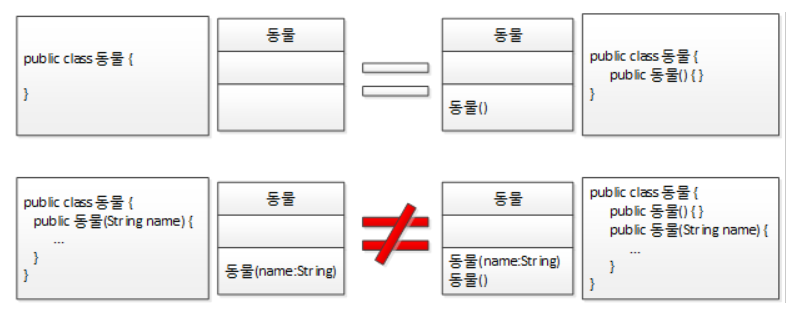
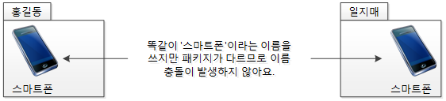

# 04. 자바가 확장한 객체 지향


## abstract 키워드 - 추상메서드와 추상 클래스 

```
추상 메서드 : 선언부는 있지만 구현부가 없는 메서드
추상 클래스 : 추상 메서드를 하나라도 갖고 있는 클래스
```

#### 추상 메서드는 왜 필요할까?

상속 관계에서 상위 클래스 타입 객체 참조변수로 하위클래스 객체를 생성했을 때, 상위 클래스의 메서드는 반드시 존재해야 하기때문에 구현하기가 난감😅하다. 바로 이런 경우 **추상 메서드**를 사용하게 된다. 메서드 선언은 있으외 몸체는 없는 형태로 메서드를 구현하는 것이다. 또한 추상 클래스는 인스턴스, 즉 객체를 만들 수 없는 클래스가 된다. 따라서 추상 클래스를 사용하면 실수로 상위 클래스 객체를 만들지 않게 하거나 상위 클래스 타입 참조 변수 배열로 모든 하위 클래스에서 오버라이딩한 메서드를 사용하게 하려면 원래 상위 클래스에 해당 메소드가 필요한 문제를 해결할 수 있다.

<br/>

이를 정리하면,

- 추상 클래스는 인스턴스, 즉 객체를 만들 수 없다. ➔ `new` 를 사용할 수 없다.
- 추상 메서드는 하위 클래스에게 메서드의 구현을 강제한다. ➔ 오버라이딩 강제
- 추상 메서드를 포함하는 클래스는 반드시 추상 클래스여야 한다. 

<br/>

## 생성자 

> 클래스의 인스턴스, 즉 객체를 만들때마다 **new 키워드** 사용

 ```java
 동물 뽀로로 = new 동물();
 ```

<br/>

new 클래스명() 을 자세히 보면 열고 닫는 소괄호가 보인다. 열고 닫는 소괄호는 메서드를 의미한다. 따라서 클래스명() 또한 메서드다. 반환값이 없고 클래스명과 같은 이름을 가진 메서드를 객체를 생성하는 메서드라고 해서 `객체 생성자 메서드 ` 라고 한다. 그리고 줄여서 `생성자` 라는 이름으로 더 많이 부른다. 또한 이런 메서드를 따로 만들지 않아도 자바가 알아서 인자가 없는 기본 생성자를 자동으로 만들어준다. 또한 인자를 갖는 생성자를 더 만들 수도 있다. 하지만 인자가 있는 생성자를 하나라도 만든다면 자바는 기본 생성자를 만들어주지 않는다. 생성자는 개발자가 필요한 만큼 오버로딩해서 만들 수 있다.



<br/>

이를 정리하면,

- new 클래스명()을 통해 생성자 메서드가 호출이 된다.
- 아무런 생성자도 만들지 않으면 인자가 없는 기본 생성자를 자동으로 만들어준다.
- 인자가 있는 생성자를 하나라도 만든다면 자바는 기본 생성자를 만들어주지 않는다.
- 생성자는 개발자가 필요한 만큼 오버로딩해서 만들 수 있다.

<br/>

## 클래스 생성 시의 실행 블록, static 블록


#### 객체 생성자가 있다면 클래스 생성자도 있지 않을까?

자바에서는 객체 생성자와 달리 클래스 생성자는 따로 존재하지 않지만 클래스가 스태틱 영역에 배치될 때 실행되는 코드 블록이 있다. 바로 `static 블록` 이다. 그리고 프로그램이 시작될 때 모든 패키지와 모든 클래스가 스태틱 영역에 로딩되는 것이 아니라 실제로는 해당 패키지 또는 클래스가 **처음으로 사용될 때** 로딩된다. 이때 단 한번 해당 클래스의 `static 블록` 이 실행된다.


여기서 클래스가 제일 **처음 사용될 때**는 언제 ?? 

- 클래스의 정적 속성을 사용할 때
- 클래스의 정적 메서드를 사용할 때
- 클래스의 인스턴스를 최초로 만들 때

<br/>

## final 키워드

> final은 마지막, 최종이라는 의미를 가진 단어로, **final 키워드**가 나타날 수 있는 곳은 **클래스, 변수, 메서드**다.


#### 1. final과 클래스

클래스에 final이 붙었다면 상속을 허락하지 않는다는 의미, 따라서 하위 클래스를 만들 수 없다.

#### 2. final과 변수

```java
public class 고양이 {
    final static int 정적상수1 = 1;
    final static int 정적상수2;
    
    final int 객체상수1 = 1;
    final int 객체상수2;
    
    static {
        정적상수2 = 2;
        
        // 상수는 한 번 초기화되면 값을 변경할 수 없다.
        // 정적상수2 = 4;
   }
   
   고양이() {
       객체상수2 = 2;
       
       // 상수는 한 번 초기화되면 값을 변경할 수 없다.
       // 객체상수2 = 4;
       
       final int 지역상수1 = 1;
       final int 지역상수2;
       
       지역상수2 = 2;
    }
}
```

변수에 final 키워드를 붙이면 변경 불가능한 상수가 된다. 정적 상수는 선언 시에, 또는 정적 생성자에 해당하는 static 코드 블록 내부에서 초기화가 가능하다. 객체 상수 역시 선언 시에, 또는 객체 생성자 또는 인스턴스 블록에서 초기화할 수 있다. 지역 상수 역시 선언 시에, 또는 최초 한 번만 초기화가 가능하다.

#### 3. final과 메서드

메서드가 final이면 최종이니 재정의, 즉 오버라이딩을 금지하게 된다.

<br/>

## instanceOf 연산자

>  `instanceOf 연산자`는 만들어진 **객체가 특정 클래스의 인스턴스인지** 물어보는 연산자이다. 

- 반환값 : true 또는 false를 반환한다.
- 사용법 : ( **객체참조변수 instanceof 클래스명** )


```java
class 동물 {
}

class 조류 extends 동물 {
}

class 펭귄 extends 조류 {
}

public class Driver {
    public static void main(String[] args) {
        동물 동물객체 = new 동물();
        동물 조류객체 = new 조류();
        동물 펭귄객체 = new 펭귄();
    
        System.out.println(동물객체 instanceOf 동물);
        
        System.out.println(조류객체 instanceOf 동물);
        System.out.println(조류객체 instanceOf 조류);
        
        System.out.println(펭귄객체 instanceOf 동물);
        System.out.println(펭귄객체 instanceOf 조류);
        System.out.println(펭귄객체 instanceOf 펭귄);
        
        System.out.println(펭귄객체 instanceOf Object);
    }
}
```

➔ 실행 결과는 모두 true이다. instanceof는 객체 참조 변수의 타입이 아닌 **실제 객체 타입에 의해 처리**하기 때문이다.

###### (instaceOf 연산자는 클래스들의 상속관계 뿐만 아니라 인터페이스의 구현 관계에서도 동일하게 적용된다.)

<br/>

## package 키워드

`package 키워드` 는 네임스페이스(이름공간)을 만들어주는 역할을 한다. **각자 다른 패키지에 동일한 클래스 이름**이 있어도 완전 별개의 클래스가 된다.




<br/>

## interface 키워드와 implements 키워드

> **인터페이스는 public 추상 메서드와 public 정적 상수만을 가진다.**

```java
interface speakable {
   double PI = 3.14159;
   final double absoluteZeroPoint = -275.15;
   
   void sayYes();
}

interface Speakable {
   public static final double PI = 3.14159;
   public static final double absoluteZeroPoint = -275.15;
   
   public abstract void sayYes();
}
```

**인터페이스는 추상 메서드와 정적 상수만 가질 수 있기에** 따로 메서드에 public과 abstract 속성에 public과 static, final을 붙이지 않아도 자동으로 컴파일러가 붙여준다.

- 둘 중 어느 것이 더 좋은 코드일까? ➔ **public과 static, final, abstrac**t가 붙은 코드 ( **명확한게 좋아!!** )
- 변수에 값을 할당할 수 없다? ➔ 상수, 즉 **final** 변수
- 클래스명으로 접근할 수 있는 속성은? ➔ **정적** 속성

<br/>

**참고 :** 자바 8 부터 인터페이스는 **디폴트 메서드**라고 하는 **객체 구상 메서드와 정적 추상 메서드** 또한 지원할 수 있게 언어 스펙이 바뀌었다.

> ***람다(Lambda)***
>
> *람다란 함수를 의미하고, 변수에 할당할 수있다. 함수는 로직이다. 이를 삼단 논법으로 전개해 보면 결국 **람다는 변수에 저장할 수 있는 로직이다.** 변수는 값을 저장할 수 있고, 메서드의 인자로 쓰일 수 있고, 메서드의 반환값으로 사용할 수 있다. **결국 람다로 인해 변수에 로직을 저장할 수 있고, 로직을 메서드의 인자로 쓸 수 있고, 로직을 메서드의 반환값으로 사용할 수 있다는 결론**에 도달한다.*
>
> *이러한 특징들은 함수형 언어의 특징이기 때문에 자바 8이 함수형 언어의 특징 또한 추가했다는 것을 의미한다.*

<br/>

## this 키워드

`this는 객체가 자기 자신을 지칭할 때 쓰는 키워드 `이다. 지역변수와 객체변수의 이름이 동일하다면 **지역변수에 우선권**이 있다. 즉, 지역 변수에 저장되어 있는 값이 아닌 객체 변수에 저장되어 있는 값을 사용하고 싶은데 지역 변수와 객체 변수의 이름(`var`)이 같을 경우 `this.var ` 라고 하면 객체 변수 var에 저장한 값을 사용하게 된다.

- 지역 변수와 속성(객체 변수, 정적 변수)의 이름이 같은 경우 지역 변수가 우선한다.
- 객체 변수와 이름이 같은 지역 변수가 있는 경우 객체 변수를 사용하려면 this를 접두사로 사용한다.
- 정적 변수와 이름이 같은 지역 변수가 있는 경우 정적 변수를 사용하려면 클래스명을 접두사로 사용한다.

<br/>

## super 키워드

> super는 바로 **위 상위 클래스의 인스턴스를 지정**하는 키워드다.

- super 키워드를 이용해 상위 클래스의 인스턴스 메서드를 호출한다. 
- 그러나 super.super 형태로 상위의 상위 클래스의 인스턴스에는 접근이 불가능하다.


