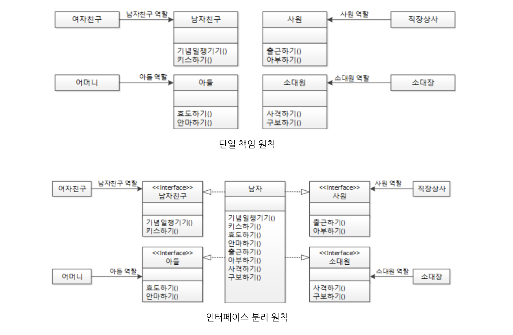
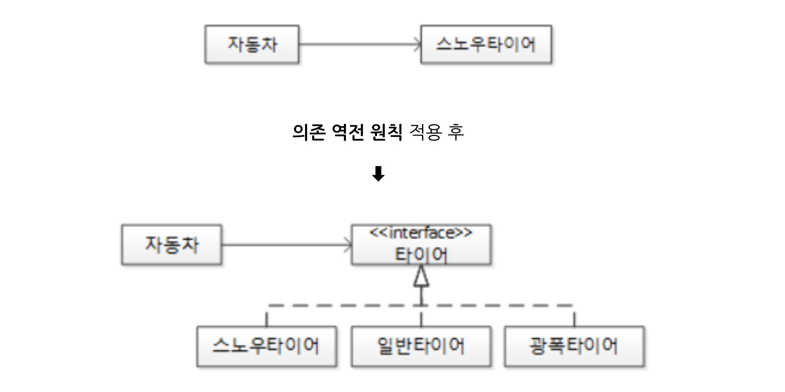

# 05. 객체 지향 설계 5원칙

> **SOLID : SRP/OCP/LSP/ISP/DIP**

##### *➔ 응집도는 높이고(High Cohesion), 결합도는 낮추는(Loose Coupling) 고전 원칙을 객체 지향의 관점에서 재정립*

##### *➔ SOLID를 잘 녹여낸 소프트웨어는 이해하기 쉽고, 리팩토링과 유지보수가 수월할 뿐만 아니라 논리적으로 정연하다*


###### 참고

> ***결합도와 응집도***
>
> *좋은 소프트웨어 설계를 위해서는 결합도는 낮추고 응집도는 높이는 것이 바람직하다. 결합도는 모듈(클래스) 간의 상호 의존 정도로서 결합도가 낮으면 모듈 간의 상호 의존성이 줄어들어 객체의 수정, 유지보수가 용이하다. 응집도는 하나의 모듈 내부에 존재하는 구성 요소들의 기능적 관련성으로, 응집도가 높은 모듈은 하나의 책임에 집중하고 독립성이 높아져 재사용이나 기능의 수정, 유지보수가 용이하다.*

<br/>

## SRP(Single Responsibility Principle) : 단일 책임 원칙

> ***"어떤 클래스를 변경해야 하는 이유는 오직 하나뿐이어야 한다."*** - 로버트 C. 마틴

- **클래스를 역할에 따라 분리해서 각각 하나의 역할과 책임만 갖게 하는 것**이 단일 책임 원칙이다. 
- 클래스 뿐만 아니라 단일 책임 원칙은 속성, 메서드, 패키지, 모듈, 컴포넌트, 프레임워크 등에도 적용할 수 있다.

<br/>

```tex
예) 
  남자는 반드시 군대를 가고, 여자는 절대로 군대를 가지 않는다고 가정해보자.
  사람 클래스에 '군번' 속성이 있다면 어떻게 될까?
  여자인 객체는 해당 속성이 필요 없는데 제거할 방법이 없다... 
  
  해결 방법은? → "단일 책임 원칙" 적용!
  사람 클래스를 남자 클래스와 여자 클래스로 분할하고 남자 클래스에만 '군번' 속성을 갖게하면 된다.
  
  남자 클래스와 여자 클래스에 공통점이 없다면 사람 클래스는 제거하고, 공통점이 많다면 사람 클래스를 상위 클래스로 
  해서 공통점을 상위 클래스에 두고 남자 클래스와 여자 클래스는 사람 클래스를 상속받고 차이점만 각자 구현하면 된다.
```

**클래스**뿐만 아니라 **하나의 속성**이 여러 의미를 갖는 경우도 단일 책임 원칙을 지키지 못하는 경우가 될 수 있고, **메서드**가 단일 책임 원칙을 지지 않았을 때 나타나는 대표적인 현상인 분기 처리를 위한 if문이 나타날 수도 있다.

<br/>

#### 단일 책임 원칙과 가장 관계가 깊은 것은 **바로 모델링 과정을 담당하는 `추상화`** 이다. 

애플리케이션 경계를 정하고 추상화를 통해 클래스들을 선별하고 속성과 메서드를 설계할 때 반드시 단일 책임 원칙을 고려하는 습관을 들여야 한다. 또한, 리팩터링을 통해 코드를 개선할 때도 단일 책임 원칙을 적용할 곳이 있는지 살펴보아야 한다.

<br/>

## OCP(Open Closed Principle) : 개방 폐쇄 원칙

> ***"소프트웨어 엔티티(클래스, 모듈, 함수 등)는 확장에 대해서는 열려 있어야 하지만 변경에 대해서는 닫혀 있어야 한다."*** - 로버트 C.마틴

> ***"자신의 확장에는 열려 있고, 주변의 변화에 대해서는 닫혀 있어야 한다."***

<br/>

#### 데이터베이스 프로그래밍과 관련하여 좋은 예가 있다. 바로 `JDBC` 이다. 

JDBC 인터페이스를 사용하더라도 Connection 설정 부분을 별도의 파일로 분리해두면 Connection을 설정하는 부분외에는 클라이언트 코드는 변경할 필요가 없다. 오라클을 MySQL이나 MS-SQL로 교체할 때 자바 애플리케이션은 JDBC 인터페이스라고 하는 완충장치로 인해 변화에 영향을 받지 않는다. 바로 **자바 애플리케이션은 데이터베이스라고 하는 주변의 변화에는 닫혀 있는 것이다. 데이터베이스를 교체한다는 것은 데이터베이스가 자신의 확장에는 열려 있다는 것**이다.

<br/>

#### 자바에서도 **개방 폐쇄 원칙**이 적용되어 있다. 

자바 개발자는 작성하고 있는 소스코드가 어떤 운영체제에서 구동될지 걱정하지 않아도 된다. 각 운영체제별 `JVM`ㅍ과 `목적 파일(.class)` 가 있기 때문에 자신이 작성하고 있는 코드에만 신경쓰면 된다. **개발자가 작성한 소스코드는 운영체제의 변화에 닫혀있고, 각 운영체제별 JVM은 확장에 열려있는 구조가 되는 것**이다. 개발자의 소스코드와 운영체제의 JVM 사이에는 목적파일이라고 하는 완충 장치가 있는 것이다.

<br/>

## LSP(Liskov Substituion Principle) : 리스코프 치환 원칙

> ***"서브 타입은 언제나 자신의 기반 타입(base type)으로 교체할 수 있어야 한다."*** - 로버트 C. 마틴

- 객체 지향에서의 상속은 ~~조직도나 계층도~~가 아닌 **분류도**가 되어야 한다.

- 객체 지향에서의 상속은 다음의 조건을 만족해야 한다.
   - 하위 클래스 is a kind of 상위 클래스 - 하위 분류는 상위 분류의 한 종류다.
   - 구현 클래스 is able to 인터페이스 - 구현 분류는 인터페이스할 수 있어야 한다.

<br/>

위 두 문장대로 구현한 프로그램은 이미 **리스코프 치환 원칙**을 잘 지키고 있다고 할 수 있다. 그러나 위 문장대로 구현되지 않은 코드가 존재할 수 있는데 바로 상속이 조직도나 계층도 형태로 구현된 경우다. 다음은 객체 지향의 상속을 잘못 적용한 예로, 전형적인 계층도 형태이다. 상위 클래스의 객체 참조 변수에는 하위 클래스의 인스턴스를 할당할 수 있는데 

```java
아버지 춘향이 = new 딸();
```

춘향이는 아버지형 객체 참조 변수이기 때문에 아버지 객체가 가진 행위(메서드)를 할 수 있어야 한다. 춘향이가 아버지 역할을 하는 것이 맞을까? 음.. 이상하다😳 이번에는 **분류도** 형태인 경우를 보자.

```java
동물 뽀로로 = new 펭귄();
```

이 경우는 펭귄 한 마리가 태어나 뽀로로라 이름을 짓고 동물의 행위(메서드)를 하는데 전혀 이상함이 없다😄 


정리하면, 

- 분류도의 경우 하위 클래스의 인스턴스는 상위형 객체 참조 변수에 대입해 상위 클래스 인스턴스의 역할을 하는데 문제가 없다.

- 결국 리스코프 치환 원칙은 객체 지향의 `상속` 이라는 특성을 올바르게 사용하면 자연스럽게 얻게 되는 것이다.

<br/>

## ISP(Interface Segregation Principle) : 인터페이스 분리 원칙

> ***"클라이언트는 자신이 사용하지 않는 메서드에 의존 관계를 맺으면 안된다."*** - 로버트 C.마틴



- **단일 책임 원칙** 적용 :  하나의 역할(책임)만 하는 다수의 클래스로 분할하는 것 

- **인터페이스 분리 원칙** 적용 : 클래스가 사용하는 기능만 제공하도록 인터페이스를 분리하는 것


**단일 책임 원칙(SRP)와 인터페이스 분리 원칙(ISP)는 같은 문제에 대한 두 가지 다른 해결책이라고 볼 수 있다.** 프로젝트 요구사항과 설계자의 취향에 따라 단일 책임 원칙이나 인터페이스 분할 원칙 중 하나를 선택해서 설계할 수 있다. 하지만 특별한 경우가 아니라면 단일 책임 원칙을 사용하는 것이 더 좋은 해결책이라고 할 수 있다.

<br/>

#### 인터페이스 최소주의 원칙

- 그 역할에 충실한 최소한의 메서드만 제공하는 것이다.
- 상위 클래스는 풍성할수록 좋고, 인터페이스는 작을 수록 좋다.

<br/>

## DIP(Dependency Inversion Principle) : 의존 역전 원칙

> ***"고차원 모듈은 저차원 모듈에 의존하면 안 된다. 이 두 모듈 모두 다른 추상화된 것에 의존해야 한다."***

> ***"추상화된 것은 구체적인 것에 의존하면 안 된다. 구체적인 것이 추상화된 것에 의존해야 한다."***

> ***"자주 변경되는 구체(Concrete) 클래스에 의존하지 마라."*** - 로버트 C.마틴



자동차는 자신보다 더 자주 변하는 스노우타이어(계절이 바뀌면 일반 타이어로 교체)에 의존하고 있다. 타이어가 교체되면 자동차는 영향을 받아야 할까? **의존 역전 원칙**을 적용해보자! 적용 후에는 자동차가 구체적인 타이어들이 아닌 **추상화된 타이어 인터페이스**에만 의존하게 함으로써 스노우타이어에서 일반타이어로 교체되어도 자동차는 그 영향을 받지 않게 된다. 

기존에는 스노우타이어가 그 무엇에도 의존하지 않는 클래스였는데, 추상적인  타이어 인터페이스에 의존하게 되면서 **의존의 방향이 역전**되었다. 그리고 자동차는 자신보다 변하기 쉬운 스노우타이어에 의존하던 관계를 중간에 추상화된 타이어 인터페이스를 추가하여 **의존 관계를 역전**시키고 있다. 

<br/>

***"다시 정리하면, 의존 역전 원칙이란, 자신보다 변하기 쉬운 것에 의존하던 것을 추상화된 인터페이스나 상위 클래스를 두어 변하기 쉬운 것의 변화에 영향받지 않게 하는 것이다. 즉, 자신보다 변하기 쉬운 것에 의존하지 마라!!"***

<br/>

## SOC(Separation Of Concerns)

> SoC : 관심사의 분리(Separation of Concerns)의 약자

- 관심이 같은 것끼리는 하나의 객체 안으로 또는 친한 객체로 모으고, 관심이 다른 것은 가능한 한 따로 떨어져 서로 영향을 주지 않도록 분리하라는 것
- 하나의 속성, 하나의 메서드, 하나의 클래스, 하나의 모듈, 또는 하나의 패키지에는 하나의 관심사만 들어 있어야 하며 관심사가 다르고 변화의 시기가 다르면 분리해야 한다는 것
- SoC를 적용하면 자연스럽게 단일 책임 원칙(SRP), 인터페이스 분리 원칙(ISP), 개방 폐쇄 원칙(OCP)에 도달하게 될거야〰️

