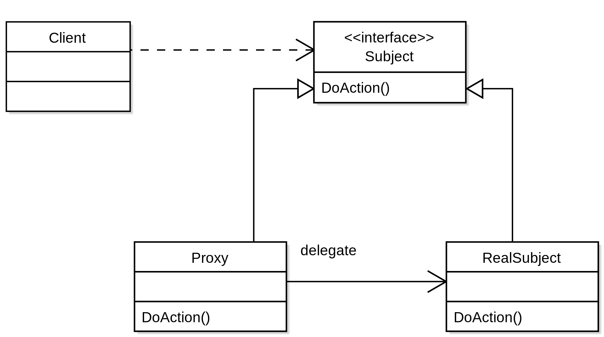
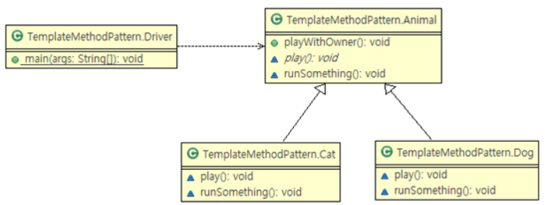
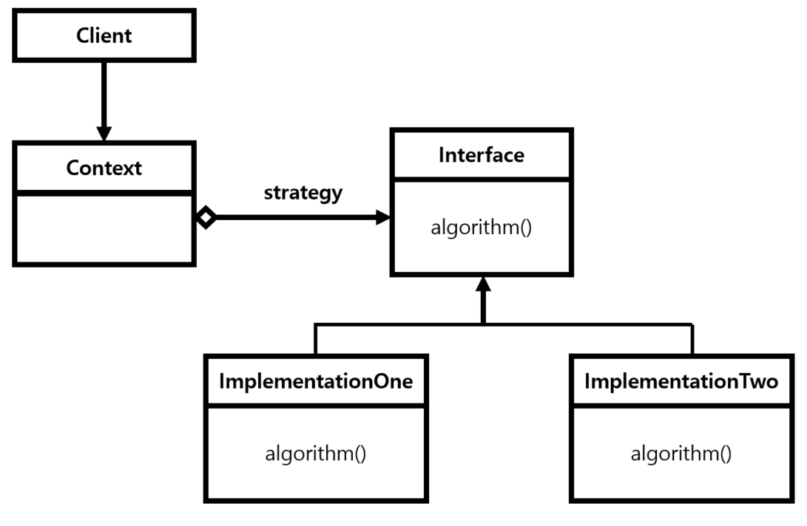

# ch6 : 스프링이 💗한 디자인 패턴

요리를 하려면 **도구 (객체 지향 특성)** 가 필요하고 **도구를 올바르게 사용하는 방법 (SOLID 원칙)**을 알아야 한다. 여기서 다음으로 필요한 것은 요리법, 즉 **레시피**이다. → '디자인 패턴'

실제 개발 현장에서 비즈니스 요구 사항을 프로그래밍으로 처리하면서 만들어진 다양한 해결책 중에서 많은 사람들이 인정한 Best Practice 정리한 것,

이를 디자인 패턴이라 칭하고 Design은 **설계**의 뜻을 담고 있다.

**스프링과 디자인 패턴**

스프링은 자바 엔터프라이즈 개발을 편하게 해주는 **객체 지향의 특성과 설계 원칙을 극한까지 적용**한 프레임 워크 이다. 따라서 스프링 역시 다양한 디자인 패턴을 활용하고 있다.

**디자인 패턴을 소개하기에 앞서,**

디자인 패턴은 '상속'(extends), '인터페이스'(interface/ implements), '합성'(객체를 속성으로 사용)을 이용한다. 그러다 보니 여러 디자인 패턴이 비슷하게 보일 수 있다!

❗상속(is-a) vs 합성(has-a)
    
   **상속의 단점**
    
   1. 캡슐화를 위반 할 수 있다.
   2. 상위 클래스 변경이 어렵다.
   3. 설계가 유연하지 않다. → 클래스 폭발 또는 조합의 폭발 문제
   4. 상속 관계는 컴파일 타임에 결정되고 고정되기 때문에 코드를 실행하는 도중에 변경할 수 없다.
    
   **합성이란?**
    
   객체가 다른 객체의 참조를 얻는 즉, 속성으로 사용하는 방식으로 **런타임시에 동적으로** 이루어진다.
    
   합성은 내부에 포함되는 객체의 구현이 아닌 인터페이스만을 바라보게 됨으로써 캡슐화가 잘 이뤄질 수 있다.
    
   **합성의 단점**
    
   객체 간의 관계가 수직이 아닌 수평 관계로 이루어져 객체나 메서드 명이 명확하지 않으면 코드가 가독성이 떨어지고 이해하기 어려워 질 수 있다. **따라서** 합성을 구현할 때는 그 용도에 따라 클래스들을 패키지로 적절히 구분하고 각각의 사용 용도가 명확하게 드러나도록 인터페이스를 설계해야 한다.
    
   **결론**
    
   is-a 관계인지 has-a 관계인지(단순히 코드 재사용) 명확하게 파악하자! 그리고 인터페이스가 단일 책임을 지키는지 분리가 필요한지 고려해서 설계하자!

    

# 🔌 Adapter Pattern (어뎁터 패턴)
---

쉽게 말하면 변환기 (converter), 즉 휴대폰 충전기와 같이

> 호환성이 없는 인터페이스 때문에 함께 동작할 수 없는 클래스들의 인터페이스를 클라이언트가 기대하는 다른 인터페이스로 변환하는 패턴
> 

예를 들어 다양한 데이터 베이스를 조작할수 있게 하는 ODBC/JDBC 와 플랫폼 별 JRE 가 어댑터 패턴이라 할 수 있다.

**→ 개방폐쇄 원칙 (OCP)** 를 활용한 설계 패턴!

**2가지 방식이 존재**

1. 클래스 어댑터 :
    
    is-a 방식으로 상속을 사용
    
2. 객체 어댑터 : 
    
    has-a 방식으로 합성을 사용
    

**구성 요소**

- Client - Target 인터페이스를 요구하는 요소를 지닌 클래스
- Target - Client 가 직접적으로 사용하려고 하는 인터페이스를 정의
- Adaptee - 기존 코드로 개조 당하는 쪽을 의미
- Adapter - Adaptee 클래스를 Target 인터페이스에 맞춰주는 클래스
    
    (흐름) →  **Client 는 Target Interface 를 통해 Adapter에 요청을 보낸다. Adapter는 Client 의 요청을 Adaptee 가 이해할 수 있는 방법으로 전달하고, 처리는 Adaptee 에서 이루어진다.**
    
**📍 코드**
    
   **배경 상황**
    
   학생 A는 새로운 집으로 이사를 갔다. 새 집은 110V의 콘센트만 있었고  A의 핸드폰은 220V로 충전을 할 수 있다. 그렇다고 집의 모든 콘센트를 220V로 바꿀수 없으니 220v를 110v로 바꿔주는 어뎁터를 사용하여 핸드폰을 충전하기로 했다
    
   ```java
   public class NewHouse extends House{  // Adaptee
    
       @Override
       public void charging(int volt) {
           if (volt == 110) {
                System.out.println("충전이 시작됩니다.");
           } else {
               System.out.println("충전할 수 없습니다.");
           }    
    	}   }
   ```
    
   ```java
   public interface Adapter{  // Target
    
       public void charging();
       public int changeVolt();
    
   }
   ```
    
   ```java
   public class AdapterImpl implements Adapter{  //Adapter
    
       private House house;
       private final int volt = 220;
   
       public AdapterImpl(House house) {
           this.house = house;
       }
    
        @Override
        public void charging() {
            int changedVolt = changeVolt();
            house.charging(changedVolt);
        }
    
        @Override
        public int changeVolt() {
            System.out.println("110v로 전환합니다.");
            return volt-110;
        }
    
    }
   ```
    
   ```java
    public class Person { // Client
    
        public static void main(String[] args) {
            NewHouse newHouse = new NewHouse();
    				Adapter adapter = new AdapterImpl(newHouse);
            adapter.charging();
        }
    
    }
   ```

    

**사용 이유**

기존 코드를 변화해서 호출해야 하는 경우에 기존 코드를 변경하는 것은 엄청난 비용과 위험을 동반하기 때문에 어댑터 패턴을 사용하여 새 코드를 효율적으로 사용하고 유지 보수 할 수 있다.

## 👥 Proxy Pattern (프록시 패턴)
---

쉽게 말해 대리자 / 대변인 으로,

> 실제 서비스 메서드의 결과값을 조작하거나 변경하지 않고 제어의 흐름을 변경하거나 다른 로직을 수행하기 위한 목적으로 중간에 대리자를 두는 패턴
> 

개방 폐쇄 원칙(OCP) 과 의존 역전 원칙(DIP)이 적용된 설계 패턴

- **구조 & 다이어그램**
    
    
    
         출처 : [https://ko.wikipedia.org/wiki/프록시_패턴](https://ko.wikipedia.org/wiki/%ED%94%84%EB%A1%9D%EC%8B%9C_%ED%8C%A8%ED%84%B4)
    
    - **Subject**
        - Proxy 와 RealSubject 가 구현해야하는 인터페이스
        - 두 객체를 동일하게 다루기 위해 존재
    - **Proxy**
        - RealSubect 와 Client 요청 사이에 존재하는 객체
        - RealSubject 에 대한 참조 변수를 갖는다.
        - RealSubject의 메서드 호출 전후에 별도의 로직을 수행할 수 있다.
    - **RealSubject**
        - 실질적으로 요청에 대해 주된 기능을 수행하는 객체

**📍 코드**
    
   ```java
    public interface IService { // Subject
    	String runSomething();
    }
   ```
    
   ```java
    public class Service implements IService { // **RealSubject**
    	public String runSomething() {
    		return "서비스 짱!!!";
    	}
    }
   ```
    
   ```java
    public class Proxy implements IService { // Proxy
    	IService service1;
    
    	public String runSomething() {
    		System.out.println("호출에 대한 흐름 제어가 주목적, 반환 결과를 그대로 전달");
    
    		service1 = new Service();
    		return service1.runSomething();
    	}
    }
   ```
    
   ```java
    public class ClientWithProxy {
    	public static void main(String[] args) {
    		// 프록시를 이용한 호출
    		IService proxy = new Proxy();
    		System.out.println(proxy.runSomething());
    	}
    }
   ```
  

**사용 이유**

- 기본 객체가 리소스 집약적인 경우, 세부 작업들은 프록시 객체가 처리하고 기본 객체를 캐싱할 수 있다.
- 기본 객체에 대한 수정 없이, 클라이언트와 기본 객체 사이에 일련의 로직을 프록시 객체에 추가할 수 있다. (기본 객체에 대한 접근 권한 제어)
- 클라이언트와 기본 객체의 사이에서 일종의 보안의 역할을 할 수 있다.

가상 프록시와 보호 프록시, 원격 프록시, 캐싱프록시 등 다양한 종류가 있다.

## 🎨 Decorator Pattern (데코레이터 패턴)
---

> 메서드 호출의 반환값에 변화를 주기 위해 중간에 장식자를 두는 패턴


**📍 코드**
    
   ```java
    public interface IService {
    	public abstract String runSomething();
    }
   ```
    
   ```java
    public class Service implements IService {
    	public String runSomething() {
    		return "서비스 짱!!!";
    	}
    }
   ```
    
   ```java
    public class Decoreator implements IService {
    	IService service;
    
    	public String runSomething() {
    		System.out.println("호출에 대한 장식 주목적, 클라이언트에게 반환 결과에 장식을 더하여 전달");
    
    		service = new Service();
    		return "정말" + service.runSomething();
    	}
    }
   ```
    
   ```java
    public class ClientWithDecolator  {
    	public static void main(String[] args) {
    		IService decoreator = new Decoreator();
    	 	System.out.println(decoreator.runSomething());
    	}
    }
   ```


데코레이터 패턴과 프록시 패턴은 동일한 구조를 갖는다. 그렇다면 **차이점은?? ** 

**Decorator VS Proxy VS Adaptor**

'의도와 목적의 차이점!!'

**데코레이터는** 중간에서 책임(기능) 추가를 위해 객체를 감싸서 새로운 행동을 추가하기 위한 용도이고, **프록시는** 중간에서 기능의 추가가 아닌 접근 제어와 같은 추가적인 컨트롤을 제공한다고 볼 수 있다.

**어댑터는** 중간에서 호환성을 위해 클라이언트가 사용하고자 하는 다른 인터페이스로 변경해준다.

❗프록시 패턴에서는 Wrapper Class와 Real Class의 관계가 컴파일타임에 정해집니다. 반면 데코레이터 패턴에서는 런타임에 정해지도록 되어있습니다.

##🚽 Singleton Pattern (싱글톤 패턴)
---

> "클래스의 인스턴스, 즉 객체를 하나만 만들어 공용으로 재사용하는 패턴"
> 

**특징**

- 의미상 두 개의 객체가 존재할 수 없다.
- new를 실행할 수 없도록 생성자에 private 접근 제어자를 지정한다.
- 단일 객체 참조 변수를 정적 속성으로 갖는다.
- 단일 객체 참조 변수가 참조하는 단일 객체를 반환하는 getInstance() 정적 메서드를 갖는다.
- 단일 객체는 쓰기 가증한 속성을 갖지 않는 것이 정석이다.
    
    → 읽기 전용 속성 이나 다른 단일 객체에 대한 참조를 속성으로 가진 것은 가능하다.
    

**사용 이유**

1. 메모리 측면의 효율성
    
    단일 객체를 사용하기 때문에 고정된 메모리 영역을 사용하고 추후 해당 객체에 접근할 때 메모리 낭비를 방지할 수 있다. 또한 이미 생성된 인스턴스를 재사용하니 속도 측면에서도 효율적이다.
    
2. 데이터 공유
    
    전역으로 사용되는 인스턴스이기 때문에 다른 클래스의 인스턴스들이 접근하여 사용할 수 있다.
    

**주의 사항 : trade-off를 잘 고려해야 한다!!**

- 테스트 하기 어려울 수 있다.
    
     전역으로 자원을 공유하기 때문에 서로 격리된 테스트를 진행한다면 매번 상태를 초기화 시켜 주어야 하고 그렇지 않다면 특정 상황에서 상태를 예측하기 어렵다.
    
- 멀티 스레딩 환경에서 발생할 수 있는 동시성 문제를 잘 고려 해야 한다. (syncronized 키워드 사용)
- 클라이언트가 구체 클래스에 의족하기 때문에 DIP나 OCP 원칙을 위반할 수 있다.
    
    → 내부 속성을 변경하기 어렵고 자식 클래스를 만들기 어렵기 때문에 유연성이 떨어진다.
    
**📍 코드**
    
   - **Eager Initialization(이른 초기화, Thread-safe) : 정적 바인딩(static binding)**
    
   ```java
    public class Singleton {
        // Eager Initialization
        private static Singleton uniqueInstance = new Singleton();
    
        private Singleton() {}
    
        public static Singleton getInstance() {
          return uniqueInstance; 
        }
   ```
    
   - **Lazy Initialization. Double Checking Locking(DCL, Thread-safe)**
    
   ```java
    public class Singleton {
        private volatile static Singleton uniqueInstance;
    
        private Sigleton() {}
    
        // Lazy Initialization. DCL
        public Singleton getInstance() {
          if(uniqueInstance == null) {
             synchronized(Singleton.class) {
                if(uniqueInstance == null) {
                   uniqueInstance = new Singleton(); 
                }
             }
          }
          return uniqueInstance;
        }
    }
   ```
   → 인스턴스를 생성하지 않을 경우 동기화 블록을 거치지 않기 때문에 성능의 감소를 방지 할 수 있다.
    
   ❗ volatile 란 ?
    
   Java 변수를 Main Memory에 read and write 하겠다는 것을 명시한다. 변수를 Read 할 때 CPU cache에 저장된 값이 아닌 Main Memory에서 읽기 때문에 변수 불일치 문제를 방지할 수 있다.
    
   - **Lazy Initailization. Enum(열거 상수 클래스, Thread-safe)**
   
   ```java
    public enum Singleton {
    	INSTANCE;
      
    	public static SingletonTest getInstance() {		
    		return INSTANCE;
    	}
    }
   ```
    
   → enum 인스턴스의 생성은 기본적으로 Thread-safe하고 reflection 공격에 안전하다.
    
   ❗ reflection 공격 : 네트웍이 감당할 수 없는 트래픽의 양을 생성하여 정상적인 트래픽을 처리하지 못하도록 하는 것
    
   - **LazyHolder 방식을 사용한 Lazy initialization : 가장 많이 사용되는 방식?**
        
        → androlid Context 의존성이 있는 환경일 경우 유리
        
    
   ```java
    public class Singleton {
    
        private static class InnerInstanceClass {
            private static final Singleton instance = new Singleton();
        }
        
        public static Singleton getInstance() {
            return InnerInstanceClass.instance;
        }
        
        private Singleton() {}
    
        public void print() {
        	System.out.println("**LazyHolder 방식을 사용한** singleton pattern");
        }
    }
   ```
    
   → static 멤버 클래스일지라도 컴파일 시점에서 초기화 되는 것이 아니고 getInstance() 메소드를 호출할 때 즉 런타임 시점에 초기화 되며 Thread-safe하다.
   

## Template Method Pattern (템플릿 메서드 패턴)
---

> "상위 클래스의 견본 메서드에서 하위 클래스가 오버라이딩한 메서드를 호출하는 패턴"
> 

→ 전체적으로는 구성이 동일하면서 부분적으로는 다른 구문으로 구성된 메서드의 **코드 중복을 최소화** 하고 유연하게 기능을 변경할 수 있도록 하고자 할 때유용

**구성 요소**

- 공통 로직을 수행하는 템플릿 메서드
- 하위 클래스에 오버라이딩을 강제하는 추상 메서드
- 선택적으로 오버라이딩할 수 있는 훅 (Hook) 메서드


**📍 코드**
    
   ```java
    public abstract class Animal {
    	// 템플릿 메서드
    	public void playWithOwner() {
    		System.out.println("귀염둥이 이리온...");
    		play();
    		runSomething();
    		System.out.println("잘했어");
    	}
    
    	// 추상 메서드
    	abstract void play();
    
    	// Hook(갈고리) 메서드
    	void runSomething() {
    		System.out.println("꼬리 살랑 살랑~");
    	}
    }
   ```
    
   ```java
    
    public abstract class Animal {
    	// 템플릿 메서드
    	public void playWithOwner() {
    		System.out.println("귀염둥이 이리온...");
    		play();
    		runSomething();
    		System.out.println("잘했어");
    	}
    
    	// 추상 메서드
    	abstract void play();
    
    	// Hook(갈고리) 메서드
    	void runSomething() {
    		System.out.println("꼬리 살랑 살랑~");
    	}
    }
    
   ```
    
   ```java
    public class Dog extends Animal {
    	@Override
    	// 추상 메서드 오버라이딩
    	void play() {
    		System.out.println("멍! 멍!");
    	}
    
    	@Override
    	// Hook(갈고리) 메서드 오버라이딩
    	void runSomething() {
    		System.out.println("멍! 멍!~ 꼬리 살랑 살랑~");
    	}
    }
   ```
    
   ```java
    public class Driver {
    	public static void main(String[] args) {
    		Animal bolt = new Dog();
    		Animal kitty = new Cat();
    
    		bolt.playWithOwner();
    
    		System.out.println();
    		System.out.println();
    
    		kitty.playWithOwner();
    	}
    }
   ```


**클래스 다이어 그램**



→ **의존 역전 원칙(DIP)을 활용**

## Factory Method Pattern (팩터리 메서드 패턴)
---

> 하위 클래스에서 팩터리 메서드를 오버라이딩해서 객체를 반환하는 패턴
> 

**사용 이유**

- 실제 구현내용은 자식클래스에서 구현이 되므로 세부 구현 코드를 몰라도 부모클래스에서 자유롭게 사용이 가능하여 객체 간의 **결합도가 낮아지는 효과**가 있다.
    
     → **의존 역전 원칙 (DIP)을 활용**
    
- 객체들을 한 곳에서 관리할 수 있기에 **생명주기를 관리하기 용이**하다.
- 동일한 객체의 호출이 잦을 경우 성능을 높일 수 있다.
- 생성자가 아닌 메소드로 작동하기 때문에 리턴 값을 가질 수 있다. 즉 객체를 선택함에 있어서 유연함을 가질 수 있는 방법이다

❗enum 클래스 활용

## Strategy Pattern (전략 패턴) : 디자인 패턴의 🌺

> 객체들이 할 수 있는 행위에 대해 각각 전략 클래스별로 **캡슐화 하고** 동적으로 행위의 수정이 필요한 경우 전략 클래스를 바꾸는 것만으로 유연하게 확장하는 패턴
> 

**구성 요소**

- 전략 메서드를 가진 **전략 객체**
- 전략 객체를 사용하는 **컨텍스트**
- 전략 객체를 생성해 컨텍스트에 주입하는 **클라이언트**



**📍 코드**
    
   ```java
    public interface Strategy {
    	public abstract void runStrategy();
    }
    ```
    
   ```java
    public class StrategyGun implements Strategy {
    	@Override
    	public void runStrategy() {
    		System.out.println("탕, 타당, 타다당");
    	}
    }
    
    public class StrategySword implements Strategy {
    	@Override
    	public void runStrategy() {
    		System.out.println("챙.. 채쟁챙 챙챙");
    	}
    }
    
    public class StrategyBow implements Strategy {
    	@Override
    	public void runStrategy() {
    		System.out.println("슝.. 쐐액.. 쇅, 최종 병기");
    	}
    }
   ```
    
   ```java
    public class Soldier {  // Context
    	void runContext(Strategy strategy) {
    		System.out.println("전투 시작");
    		strategy.runStrategy();
    		System.out.println("전투 종료");
    	}
    }
   ```
    
   ```java
    public class Client {
    	public static void main(String[] args) {
    		Strategy strategy = null;
    		Soldier rambo = new Soldier();
    
    		// 총을 람보에게 전달해서 전투를 수행하게 한다.
    		strategy = new StrategyGun();
    		rambo.runContext(strategy);
    
    		System.out.println();
    
    		// 검을 람보에게 전달해서 전투를 수행하게 한다.
    		strategy = new StrategySword();
    		rambo.runContext(strategy);
    
    		System.out.println();
    
    		// 활을 람보에게 전달해서 전투를 수행하게 한다.
    		strategy = new StrategyBow();
    		rambo.runContext(strategy);
    	}
    }
   ```


**사용 이유**

- 컨텍스트 코드의 변경 없이 새로운 전략을 추가할 수 있다
    
     → 클래스를 추가하여 if-else 문을 사용한 분기를 줄일 수 있다.
    
     → 유지 보수가 좋아지며 **개방 폐쇄 원칙(OCP)과 의존 역전 원칙 (DIP)**이 적용된다.
    

**그러나,** 알고리즘이 늘어남에 따라 객체도 계속해서 늘어나게 되고 클라이언트가 사용할 객체를 직접 선택해야 하기 때문에 객체간의 성능과 효율을 정확히 알고 있어야 한다.

**템플릿 메서드 패턴 VS 전략 패턴**

상속을 이용하는 템플릿 메서드 패턴 과 객체 주입을 통한 전략 패턴 은 구성은 동일하지만 사용 목적이 다르다. 템플릿 메소드 패턴은 공통된 메소드를 통해서 코드의 중복없이 사용하는 것이고 전략 패턴은 상황에 맞는 필요한 전략을 선택하기 위해 사용하는 패턴 이다.

또한, **단일 상속만이 가능하다는 제한**이 있는 템플릿 메서드 패턴 보다는 전략 패턴이 더 많이 활용된다.

## Template Callback Pattern (템플릿 콜백 패턴)
---

> 전략패턴을 변형하여 전략을 익명 내부 클래스로 구현한 패턴
> 

→ 변화되는 부분을 매번 클래스로 만들지 않고 익명 내부 클래스로 구현해 이용

→ 결합도가 증가

→ DI(의존성 주입)에서 사용

**📍 코드**
    
   ```java
    public interface Strategy {
    	public abstract void runStrategy();
    }
   ```
    
   ```java
    public class Soldier {
    	void runContext(String weaponSound) {
    		System.out.println("전투 시작");
    		executeWeapon(weaponSound).runStrategy();
    		System.out.println("전투 종료");
    	}
    
    	private Strategy executeWeapon(final String weaponSound) {
    		return new Strategy() {
    			@Override
    			public void runStrategy() {
    				System.out.println(weaponSound);
    			}
    		};
    	}
    }
   ```
    
   ```java
    public class Client {
    	public static void main(String[] args) {
    		Soldier rambo = new Soldier();
    		
    		rambo.runContext("총! 총초종총 총! 총!");
    		
    		System.out.println();
    		
    		rambo.runContext("칼! 카가갈 칼! 칼!");
    		
    		System.out.println();
    		
    		rambo.runContext("도끼! 독독..도도독 독끼!");
    	}
    }
   ```


❗ 제네릭을 람다를 활용하면 더 효율이 좋을 것 같다.
