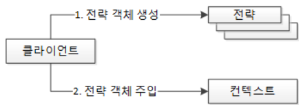

# 06 스프링이 사랑한 디자인 패턴

디자인 패턴은 실제 개발 현장에서 비즈니스 요구 사항을 프로그래밍으로 처리하면서 만들어진 다양한 해결책 중에서 많은 사람들이 인정한 베스트 프랙티스를 정리한 것이다. 디자인 패턴은 당연히 객체 지향 특성과 설계 원칙을 기반으로 구현되어 있다.

디자인 패턴은 객체 지향의 특성 중 **상속(extends)**, **인터페이스(interface & implements)**, **합성(객체를 속성으로 사용)** 을 이용한다.

<br/>

## 5. 템플릿 메서드 패턴(Template Method Pattern)

> ***객체 지향의 4대 특성 가운데 기능이 동일한 부분 즉, 중복되는 부분은 상위 클래스로, 달라지는 부분만 하위 클래스로 분할하는 특징을 가진 '상속 ' 과 관련이 있다.*** 

<br/>

```java
public abstract class Animal {
    // 템플릿 메서드
    public void playWithOwner() {
        System.out.println("귀염둥이 이리온...";
        play();
        runSomething();
        System.out.println("잘했어");
    }
    
    // 추상 메서드
    abstract void play();
    
    // Hook(갈고리) 메서드
    void runSomthing() {
        System.out.println("꼬리 살랑 살랑~");
    }
}
```

상위 클래스인 Animal에는 템플릿(견본)을 제공하는 `playWithOwner()` 메서드와 하위 클래스에게 **구현을 강제하는 `play()` 추상 메서드, 하위 클래스가 선택적으로 오버라이딩할 수 있는 `runSomething()` 메서드**가 있다. 하위 클래스인 Dog와 Cat은 상위 클래스인 Animal에서 구현을 강제하고 있는 `play()` 추상 메서드를 반드시 구현해야 한다. `runSomething()` 메서드는 선택적으로 오버라이딩할 수 있다.

<br/>

### *"상위 클래스의 견본 메서드에서 하위 클래스가 오버라이딩한 메서드를 호출하는 패턴 "*

- **템플릿 메서드 패턴** : 위와 같이 상위 클래스에 **공통 로직을 수행하는 템플릿 메서드**와 하위 클래스에 오버라이딩을 강제하는 **추상 메서드** 또는 **선택적으로 오버라이딩할 수 있는 훅(Hook) 메서드**를 두는 패턴
- 템플릿 메서드 패턴은  `의존 역전 원칙(DIP)`을 활용한 패턴이다.

<br/>

## 6. 팩토리 메서드 패턴(Factory Method Pattern)

> ***객체 지향에서 팩토리는 객체를 생성한다. 결국 팩터리 메서드는 객체를 생성 반환하는 메서드를 말한다. 하위 클래스에서 팩토리 메서드를 오버라이딩해서 객체를 반환하게 하는 것을 의미한다.***

<br/>

```java
public abstract class Animal {
    // 추상 팩토리 메서드
    abstract AnimalToy getToy();
}

// 팩토리 메서드가 생성할 객체의 상위 클래스
public abstract class AnimalToy {
    abstract void identify();
}

public Class Dog extends Animal {
    // 추상 팩토리 메서드 오버라이딩
    @Override
    AnimalToy getToy() {
        return new DogToy();
    }
}

// 팩토리 메서드가 생성할 객체
public Class DogToy extends AnimalToy {
    public void identify() {
        System.out.println("나는 테니스공! 강아지의 친구!");
    }
}

public Class Driver {
    public static void main(String[] args) {
        // 팩토리 메서드를 보유한 객체들 생성
        Animal bolt = new Dog();
        
        // 팩토리 메서드가 반환하는 객체들
        AnimalToy boltBall = bolt.getToy();
        
        // 팩토리 메서드가 반환한 객체들을 사용
        boltBall.identify();
    }
}
```

<br/>

### *"오버라이드된 메서드가 객체를 반환하는 패턴 "*

- 조건에 따른 객체 생성 부분을 자신이 직접하지 않고 팩토리 클래스에 위임하여 객체를 생성하도록 하는 방법이 팩토리 메서드 패턴이다.
- 팩토리 메서드 패턴을 적용함으로써, 객체간의 결합도가 낮아지고 유지보수에 용이해진다.

<br/>

## 7. 전략 패턴(Strategy Pattern)

> ***객체들이 할 수 있는 행위 각각에 대해 전략 클래스를 생성하고, 유사한 행위들을 캡슐화 하는 인터페이스를 정의하여, 객체의 행위를 동적으로 바꾸고 싶은 경우 직접 행위를 수정하지 않고 전략을 바꿔주기만 함으로써 행위를 유연하게 확장하는 방법***

<br/>

✔︎ 전략패턴을 구성하는 세 요소

- 전략 메서드를 가진 전략 객체
- 전략 객체를 사용하는 컨텍스트(전략 객체의 사용자/소비자)
- 전략 객체를 생성해 컨텍스트에 주입하는 클라이언트(제3자, 전략 객체의 공급자)




<br/>

"보급 장교가 무기를 군인에게 지급해 주면 군인은 주어진 무기에 따라 전투를 수행하게 된다." 라는 상황이 있다. 전략 패턴에 따라 구분해 보면 **무기는 전략이 되고, 군인은 컨텍스트, 보급 장교는 제3자, 즉 클라이언트**가 된다.

```java
public interface Strategy {
    public abstract void runStrategy();
}

public Class StategyGun implements Stategy {
    @Override
    public void runStrategy() {
        System.out.println("탕, 타당, 타다당");
    }
}

public Class StategySword implements Stategy {
    @Override
    public void runStrategy() {
        System.out.println("챙... 채재쟁 챙챙");
    }
}

public Class Soldier {
    void runContext(Strategy strategy) {
        System.out.println("전투 시작");
        strategy.runStrategy();
        System.out.println("전투 종료");
    }
}

public Class Client {
    public static void main(String[] args) {
        Strategy strategy = null;
        Soldier rambo = new Soldier();
        
        // 총을 람보에게 전달해서 전투를 수행하게 한다.
        strategy = new StrategyGun();
        rambo.runContext(strategy);
        
        System.out.println();
        
         // 검을 람보에게 전달해서 전투를 수행하게 한다.
        strategy = new StrategySword();
        rambo.runContext(strategy);
    }
}

```

<br/>

### *"클라이언트가 전략을 생성해 전략을 실행할 컨텍스트에 주입하는 패턴 "*

- 전략 패턴은 디자인 패턴의 `꽃 `이라고 할 정도로 다양한 곳에서 다양한 문제 상황의 해결책으로 사용된다. 
- 같은 문제의 해결책으로 상속을 이용하는 템플릿 메서드 패턴과 객체 주입을 통한 전략 패턴 중에서 선택/적용할 수 있다. 
- 단일 상속만이 가능한 자바 언어에서는 <u>상속이라는 제한이 있는 템플릿 메서드 패턴</u>보다는 **전략 패턴**이 더 많이 활용된다.

<br/>

## 8. 템플릿 콜백 패턴(Template Callback Pattern - 견본/회신 패턴)

> ***템플릿 콜백 패턴은 전략 패턴의 변형으로, 스프링의 3대 프로그래밍 모델 중 하나인 DI(의존성 주입)에서 사용하는 특별한 형태의 전략 패턴이다. 템플릿 콜백 패턴은 전략 패턴과 모든 것이 동일한데 <u>전략을 익명 내부 클래스로 정의</u>해서 사용한다는 특징이 있다.***

<br/>

```java
public interface Strategy {
    public abstract void runStrategy();
}

public Class Soldier {
    void runContext(Strategy weaponSound) {
        System.out.println("전투 시작");
        executeWeapon(weaponSound).runStrategy();
        System.out.println("전투 종료");
    }
    
    // 전략을 생성하는 코드가 컨텍스트, 즉 군인 내부로 들어왔다.
    private Strategy executeWeapon(final String weaponSound) {
        return new Strategy() {
            @Override
            public void runStrategy() {
                System.out.println(weaponSound);
            }
        };
    }
}

public Class Client {
    public static void main(String[] args) {
        Soldier rambo = nwe Soldier();
        rambo.runContext("총! 총조종총 총! 총!");
        rambo.runContext("칼! 카카칼 칼! 칼!");
        rambo.runContext("도끼! 독독... 도도독 독끼!");
        
    }
}
```

스프링은 이런 형식으로 리팩터링된 템플릿 콜백 패턴을 DI에 적극 활용하고 있다. 따라서 스프링을 이해하고 활용하기 위해서는 전략 패턴과 템플릿 콜백 패턴, 리팩터링된 템플릿 콜백 패턴을 잘 기억해 두어야 한다. 

<br/>

### "*전략을 익명 내부 클래스로 구현한 전략 패턴 "*

- 템플릿 콜백 패턴은 전략 패턴의 일종이므로 당연히 `개방 폐쇄 원칙(OCP)와 의존 역전 원칙(DIP) `이 적용된 설계 패턴이다.

<br/>